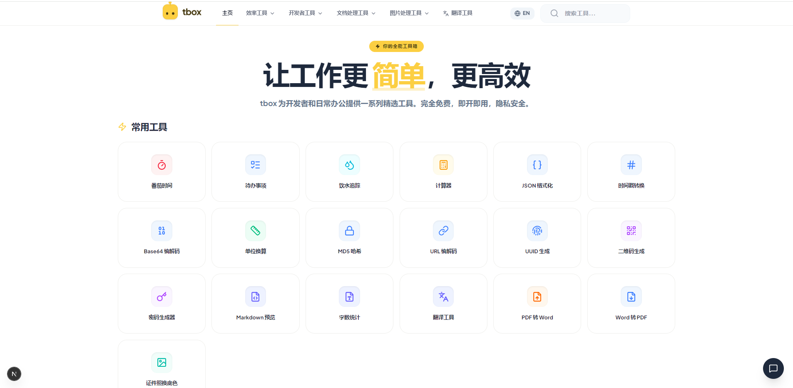

<div align="center">

# tbox - 你的全能工具箱 / Your All-in-One Toolkit

<p>简洁高效的在线工具集合，为开发者和日常使用提供便捷服务 / A clean and efficient collection of online tools for developers and everyday use</p>

[](LICENSE)
[](https://nextjs.org/)
[](https://react.dev/)



</div>

---

## 功能介绍 / Features

tbox 是一个现代化的在线工具箱，提供 **21 个精选工具**，涵盖 5 大类别：

### 效率工具 / Productivity
| 工具 | 描述 |
|------|------|
| 🍅 番茄时间 | 专注工作，高效休息 / Focus on work, rest efficiently |
| ✅ 待办事项 | 管理每日任务，提高效率 / Manage daily tasks |
| 💧 饮水追踪 | 记录每日饮水量 / Track daily water intake |
| 🔢 计算器 | 简单易用的在线计算器 / Simple calculator |
| 📏 单位换算 | 长度、面积、重量等单位转换 / Length, area, weight conversion |

### 开发者工具 / Developer Tools
| 工具 | 描述 |
|------|------|
| 📋 JSON 格式化 | JSON 校验、格式化与压缩 / Validate, format and compress JSON |
| ⏰ 时间戳转换 | Unix 时间戳与日期互转 / Convert between Unix timestamps and dates |
| 🔤 Base64 编解码 | 文本与 Base64 互转 / Encode and decode Base64 |
| 🔒 MD5 哈希 | 生成 MD5/SHA-256 哈希值 / Generate MD5/SHA-256 hashes |
| 🔗 URL 编解码 | URL 安全编码与解码 / URL-safe encoding |
| 🆔 UUID 生成 | 生成随机 UUID (v4) / Generate random UUID v4 |
| 📱 二维码生成 | 文本或链接转二维码 / Convert text/links to QR codes |
| 🔑 密码生成器 | 生成强密码 / Generate strong passwords |

### 文档处理工具 / Document Tools
| 工具 | 描述 |
|------|------|
| 📄 PDF 转 Word | PDF 文件转 Word / Convert PDF to Word |
| 📝 Word 转 PDF | Word 文档转 PDF / Convert Word to PDF |
| 📝 Markdown 预览 | 实时预览 Markdown / Real-time Markdown preview |
| 📊 字数统计 | 统计文本字数、行数、字符数 / Word, line, character count |
| 🔐 文件加密 | 安全加密文件（AES-PBKDF2）/ Secure file encryption |
| 📦 文件压缩 | 减小文件体积 / Compress files |

### 图片处理工具 / Image Tools
| 工具 | 描述 |
|------|------|
| 🖼️ 图片压缩 | 无损压缩图片 / Lossless image compression |
| 📷 证件照换底色 | 智能抠图更换证件照背景 / Change photo background |

### 翻译工具 / Translation
| 工具 | 描述 |
|------|------|
| 🌐 翻译工具 | 中英文互译 / Chinese-English translation |

---

## 技术栈 / Tech Stack

| 类别 | 技术 |
|------|------|
| 框架 | Next.js 15 (App Router) |
| 前端 | React 19 + TypeScript |
| 样式 | Tailwind CSS v4 |
| 图标 | Lucide Icons |
| 加密 | CryptoJS (AES-PBKDF2) |
| 文档转换 | Mammoth.js, jsPDF |
| 测试 | Vitest + Playwright |

---

## 快速开始 / Quick Start

### 前置要求 / Prerequisites

- **Node.js** 18.0 或更高版本
- **npm** 或 **Bun**

### 安装 / Installation

```bash
# 克隆仓库
git clone https://github.com/huangtaos/tbox.git
cd tbox

# 安装依赖
npm install
```

### 开发 / Development

```bash
npm run dev
```

访问 [http://localhost:3000](http://localhost:3000)

### 生产构建 / Production Build

```bash
npm run build
npm start
```

### 测试 / Testing

```bash
# 单元测试
npm run test

# E2E 测试
npm run test:e2e

# 带 UI 的 E2E 测试
npm run test:e2e:ui
```

---

## 部署 / Deployment

### Vercel（推荐）

[](https://vercel.com/new/clone?repository-url=https://github.com/huangtaos/tbox)

### Docker

```bash
npm run build
docker build -t tbox .
docker run -p 3000:3000 tbox
```

### 自托管 / Self-Hosting

```bash
npm run build
npm start
```

设置环境变量：

```bash
GEMINI_API_KEY=your_api_key  # For translation feature
APP_URL=https://your-domain.com
```

---

## 贡献 / Contributing

Contributions are welcome! Please see [CONTRIBUTING.md](CONTRIBUTING.md) for details.

```bash
# 1. Fork and clone
git clone https://github.com/YOUR_USERNAME/tbox.git

# 2. Create a feature branch
git checkout -b feature/my-new-tool

# 3. Make changes and test
npm run test
npm run build

# 4. Push and open PR
git push origin feature/my-new-tool
```

---

## 项目结构 / Project Structure

```
src/
├── app/                    # Next.js App Router
│   └── tools/[id]/       # Dynamic tool pages
├── components/            # Shared UI components
├── features/              # Feature modules (one directory per tool)
│   ├── json/              # JSON Formatter
│   ├── base64/            # Base64 tool
│   └── ...
├── lib/                   # Utilities
│   ├── tool-registry.ts   # Tool ID → Component mapping
│   └── I18nProvider.tsx   # i18n support
└── messages/              # Translation files
    ├── zh-CN.json
    └── en.json
```

---

## 安全说明 / Security

- ✅ 所有文件处理在浏览器本地完成，文件不会上传到服务器
- ✅ 文件加密使用 **AES-256-CBC** + **PBKDF2**（10000 次迭代）
- ⚠️ MD5 工具因存在碰撞攻击风险，已添加安全警告，推荐使用 SHA-256

> ⚠️ **注意 / Note**: MD5 工具仅用于普通数据完整性校验，不适用于密码存储等安全场景。

---

## 开源协议 / License

本项目基于 [MIT License](LICENSE) 开源。

---

## 致谢 / Acknowledgments

- [Next.js](https://nextjs.org/) - React 框架
- [Tailwind CSS](https://tailwindcss.com/) - 样式框架
- [Lucide](https://lucide.dev/) - 图标库
- [CryptoJS](https://github.com/brix/crypto-js) - 加密库

---

<p align="center">
  如果这个项目对你有帮助，请点个 ⭐️ ！<br>
  If you find this useful, please give it a ⭐️ !
</p>
